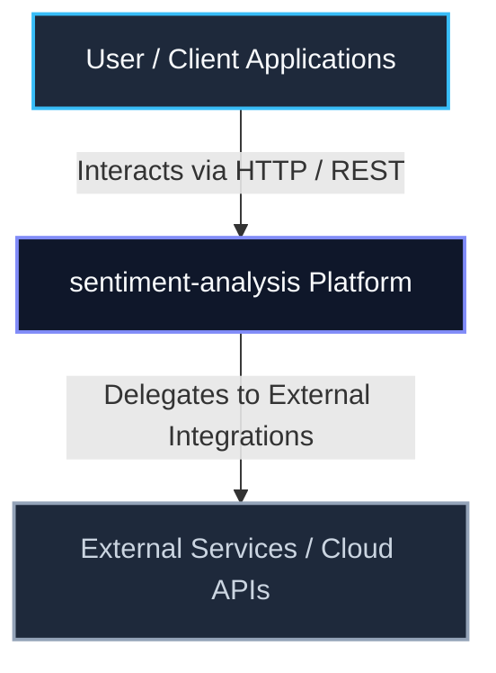
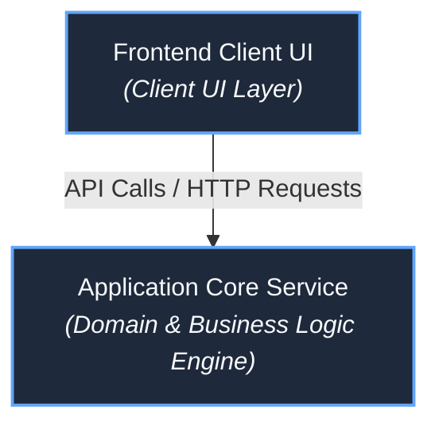

# sentiment-analysis

> **Automated Technical Documentation & Continuous Synchronization**  
> *Synchronized by RepoMind AI & ASDSE Platform*

| Repository Version | Branch | Active Commit | Primary Language | Sync State |
| :--- | :--- | :--- | :--- | :--- |
| **V1** | `main` | [`d4862ef`](https://github.com/PadmaPriya78/sentiment-analysis.git/commit/d4862ef9c8a6587b16144b28c902e1b0cedbf470) | `Python` | `✓ Grounded & Synchronized` |

> **Commit Identity**: `d4862ef` (d4862ef9c8a6587b16144b28c902e1b0cedbf470)  
> **Author**: PadmaPriya K | **Date**: 8/8/2025, 4:01:50 pm  
> **Message**: *Add files via upload*

---

## Table of Contents

- [Project Overview](#project-overview)
- [Key Features](#key-features)
- [Technology Stack](#technology-stack)
- [System Architecture](#system-architecture)
- [Repository Structure](#repository-structure)
- [Prerequisites](#prerequisites)
- [Installation & Setup](#installation--setup)
- [Environment Variables](#environment-variables)
- [Running the Application](#running-the-application)
- [Dependencies](#dependencies)
- [License](#license)

---

## Project Overview

**sentiment-analysis** is a software system built using **Python**.

This codebase provides a modular architecture designed for maintainability, with defined separation across business logic, routing, persistence, and service execution.

## Key Features

- **Clean Modular Structure**: Codebase organized into functional directories for maintainable development.

## Technology Stack

| Category | Technologies Verified in Codebase |
| :--- | :--- |
| **Primary Language** | `Python` (All: `Python`) |
| **Manifest Files** | `requirements.txt` |

## System Architecture

The repository follows a **Layered Architecture** pattern.

### System Context Diagram



### Container Architecture Diagram



## Repository Structure

| Directory / Path | Module Purpose |
| :--- | :--- |
| `.` | Application module directory |
| `Sentiment-Analysis--main` | Application module directory |
| `Sentiment-Analysis--main/task3` | Application module directory |
| `Sentiment-Analysis--main/task3/data` | Application module directory |
| `Sentiment-Analysis--main/task3/src` | Application module directory |

## Prerequisites

Ensure the following tools and runtimes are installed on your host machine:

- **Python**: 3.10 or higher
- **pip** package installer (and optional `virtualenv`)
- **Git**: v2.30+ for version control

## Installation & Setup

```bash
# 1. Clone the repository
git clone https://github.com/PadmaPriya78/sentiment-analysis.git.git
cd sentiment-analysis

# 2. Checkout the verified branch/commit
git checkout main

# 3. Install project dependencies
pip install -r requirements.txt
```

## Environment Variables

Create a `.env` file in the root directory based on the configuration template below (placeholders are sanitized):

```env
# Application HTTP server listening port
PORT=5000

# Runtime environment (development | production | test)
NODE_ENV=development

```

## Running the Application

### Development Mode

```bash
python app.py
```

## Dependencies

The system relies on **9** runtime and development dependencies defined in `requirements.txt`.

### Primary Packages

| Package | Version Range | Category |
| :--- | :--- | :--- |
| `pandas` | `1.5.0` | `Runtime` |
| `numpy` | `1.21.0` | `Runtime` |
| `textblob` | `0.17.1` | `Runtime` |
| `vaderSentiment` | `3.3.2` | `Runtime` |
| `scikit-learn` | `1.1.0` | `Runtime` |
| `nltk` | `3.7` | `Runtime` |
| `streamlit` | `1.28.0` | `Runtime` |
| `plotly` | `5.15.0` | `Runtime` |
| `tqdm` | `4.64.0` | `Runtime` |

## License

This project is licensed under the **Proprietary / Standard Repository License**.

---
*Generated automatically by [ASDSE RepoMind Intelligence](https://github.com/Spidey390/Neighbor-to-Neighbor) — Continuous Technical Documentation & GitHub Synchronization Pipeline.*
